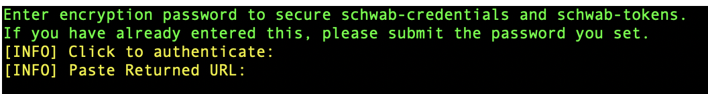

## Access-Token && Refresh Token

The first time you run this program (or about every 6-7days) you will need re-authenticate with Scwhab to recieve a working Access-Token and Refresh-Token. The Access Tokens lasts 30 minutes, this is what you use to query schwab and retireve market data and execute trades. The Refresh-Token is used to refresh the access token and is valid for about 1 week. This allows 1 week of active trading without having to interact with Schwab. This program will warn you when your Refresh-Token is nearing expiration. It will auto refresh your Access-Token unless you tell it otherwise. 

### How to access Schwab Authentication Tokens.

1) Upon running the script for the first time on the command line you will see the following image below (One you enter your encryption password).

    

2) Your default browser should open a url link to schwab. Login to schwab, this is NOT your schwab-developer account but your Brokerage login info.
    

3) You'll be prompted to confirm your identify as follows: 
    

4) You should now see "Trader API End User Terms and Conditions". Scroll through and accept, this pretty much says you're allowing this code to access your schwab information. They are not liable for any shenanigans that happens when using this software... 
    

5) You will now see a selection page for which account you want access to. I recommend creating a new brokerage specifically for this software. The example below shows me selecting my AutoTrader Account. 
    

6) Schwab will now ask you to review your selection, select Done. You will now be redirected to a localhost link that will most likely say "(Firefox/Safari) Cannot Cannot to 127.0.0.1:[...]". This is the url you will now paste into the command line. The webpage should look similar to whats shown below. 
    

    Copy Everything betweebn the two quotes, starting with "http://127.0.0.1..." and ending with the chain of random numbers and characters for the "session=" section. You can also just ```ctrl c, ctrl v``` what is in the address bar of the browser you arer using. 

7) If you see:
    ```bash
    Paste Returned URL: https://127.0.0.1/?code=$your_own_unique_code&session=$your_own_unique_session
    [SUCCESS] Authentication with Schwab successful.
    ```
    You have correctly retrieved the schwab-authentication keys and can now start running commands to look at market data or conduct trades. 